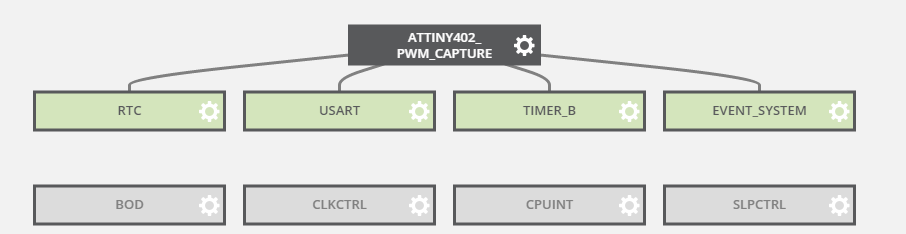

# ATTINY402 PWM Capture

ATtiny402 RC-PWM capture using a hardware based solution.

*MCU components overview:*

PWM is captured using embedded Event System linked to Timer/Count Type B. Also a PWM timeout feature is implemented using internal RTC.

Project is delivered as an **Atmel Studio 7** solution. Base code and initial MCU configuration is generated using **Atmel Start** tool (so you can modify the MCU behavior using the same mechanism).

## Main Features

- RC-PWM capture (1000µs to 2000µs range)
- Precise PWM capture with less than 0.5% measured error
- 2 seconds PWM signal timeout. It works for both HIGH and LOW input stuck signal.
- UART output for easy test/debug

## Wiring/Pin Setup

- **PA1** PWM signal input
- **PA6** TX serial communication at 9600bps